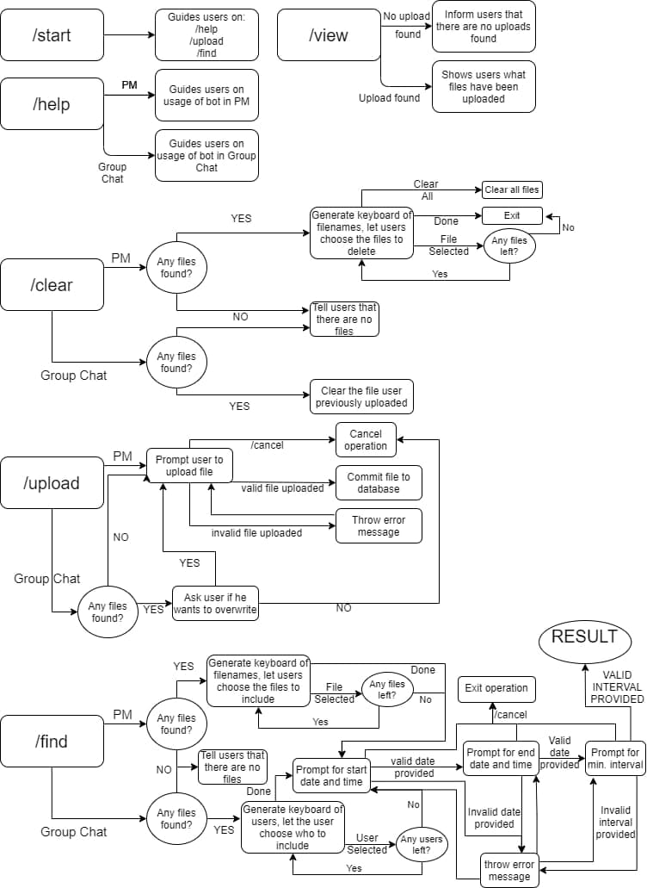
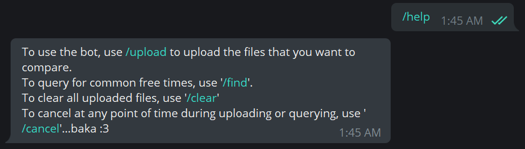
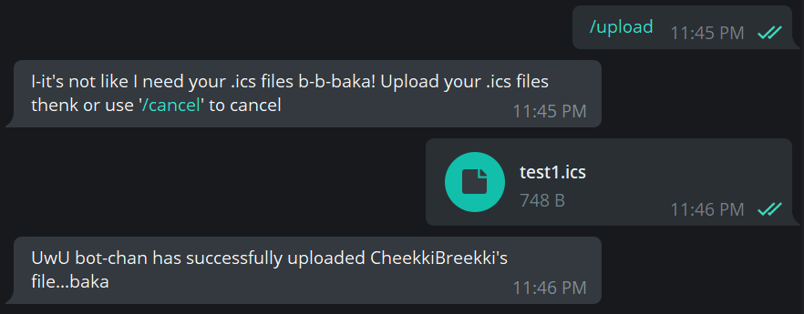
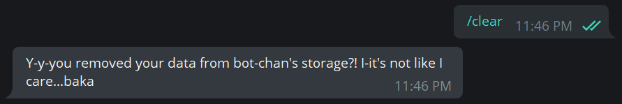
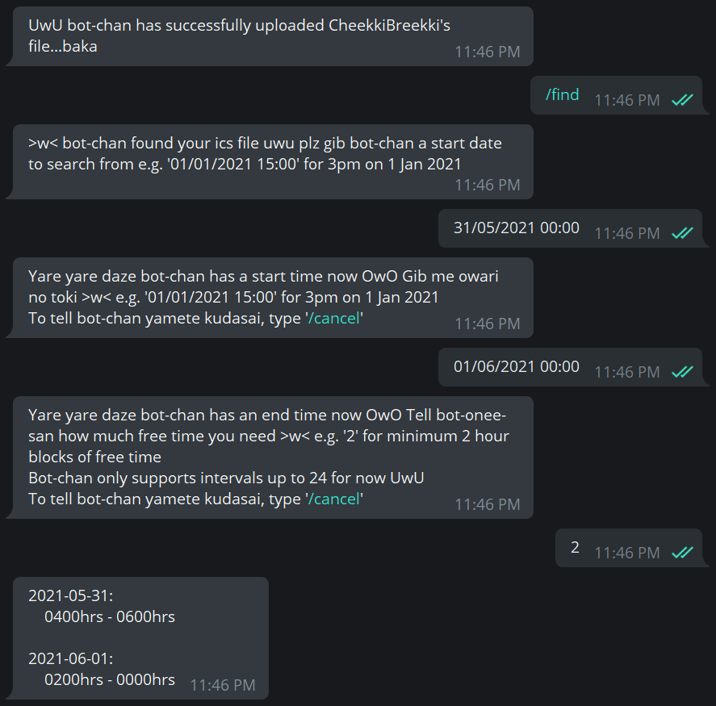
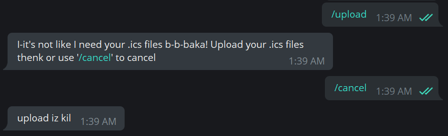
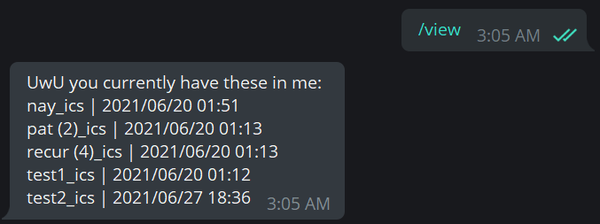

# README

Created: Jun 16, 2021 1:49 AM

## Team Name:

Team Tomodachi

---

## Proposed Level of Achievement:

Apollo 11

---

## Motivation:

Ever feel like you have too many friends and too little time to hang out? Or maybe you have some friends, but have sub-par time management so you can’t find common time to hang out?

Or maybe, you’re tired of asking your friends on Telegram “eh bro when you free” for the 42069th time and having different people give you different answers?

So are we (except for the first point). We realized that it was an arduous task to coordinate group hangouts, project meetings or even consults in NUS, given that most people take different modules and have different commitments. This got us thinking, how could we help people (especially ourselves) coordinate schedules better?

Most NUS students utilize NUSMods, while most working professionals utilize an e-calendar of some sort. This got us thinking: why are we not making use of this, but are instead still fumbling around trying to manually find a timing that works for everyone?

Aim:
We hope to bypass the cumbersome process of planning and coordinating for groups of people by automating the process of finding common time slots where everyone is free.

---

## User Stories:

1. As a user with a group of friends who have differing schedules, I want to be able to find common time slots to hang out without having to manually check day by day, person by person.
2. As a teaching assistant, a student or even a professor who wishes to set up consultations, I want to be able to schedule them with less hassle.
3. As a student involved in multiple projects, I want to be able to schedule project meetings with teammates without having to hound them.

---

## Program Flow:

---

## Development Flow:

### Milestone One (31/05/2021):

1. Setup database for Python Telegram Bot
2. Implement stand-alone algorithm for parsing .ics files and finding free times given multiple .ics files
3. Implement skeleton for Python Telegram Bot

### Milestone Two (28/06/2021):

1. Implemented core features of the Telegram bot for group use
    - Start and help menu for new users of the bot
    - Uploading of a single .ics file per user to the bot
    - Deleting the file uploaded by the specific user
    - Querying for list of free time based on
        - Selected users
        - Start Date and Time
        - End Date and Time
        - Minimum Interval (from 0 to 24 hours, in per hour blocks)
    - Exiting at any part of the upload/query process
2. Implemented core features of the Telegram bot for private use 
    - Start and help menu for new users of the bot
    - Uploading of .ics (and only .ics) files to the bot
    - Allow users to view all files uploaded by them
    - Allow users to specify which files to use (in PM mode)
    - Deleting all user-uploaded files
    - Option for users to specify which files to delete (when using bot in PM mode)
    - Querying for list of free time based on user provided start date, end date and interval
        - Start Date and Time
        - End Date and Time
        - Minimum Interval (from 0 to 24 hours, in per hour blocks)
    - Exiting at any part of the upload/query process
3. Redesign data model to store file metadata (date, name) as shown below:

    group

    groupid

    log : log

    users

    userid

    'icalrep' : icalstr

    'dateupdated' : date

    private

    userid

    log : logfile

    files

    filename

    'icalrep' : icalstr

    'datecreated' :  date

4. Deployed Telegram bot on Heroku under "when-meet-bot".

### Milestone Three (26 July):

1. Refine the algorithm
2. Implement extra features for Telegram bot
    - Option for users to generate a poll based off their search query
    - Option for group administrators to delete .ics files uploaded by members
    - Allow /start to initialize user's timezone preference (To determine offset)
    - Implement logging
        - Database wide
        - Per group/user log

---

## Tech Stack:

1. Python Telegram Bot API
2. Java/Kotlin
3. Python
4. Firebase Realtime Database
5. Heroku

---

## Description and Features:

findtimes.py (previously proofOfConcept.py) is a Python script that describes an algorithm which now accepts as input a list of text files as well as a start date, end date and a minimum duration (0 to 24 hours). It then finds blocks of free time common amongst all .ics files that are at least of the given minimum duration, between the provided start and end dates.

The Telegram bot has been prepared with a connection to the Firebase Realtime Database that will be used to store the provided .ics files based on relevant Group or User ID.

### Telegram Commands:

- `/start` → Introductory message to users

    

- `/help` → Pops out a help menu for the basic features of the bot

    

- `/upload` → upload a new .ics file

    

- `/clear` → removes all data the specific user has uploaded

    

- `/find` → performs the query based on user-defined parameters

    

- `/cancel` → Exits at any time during uploading or querying

    

- `/view` → Lists all the files the user has uploaded along with date and time.
    - Group

        

    - PM

        