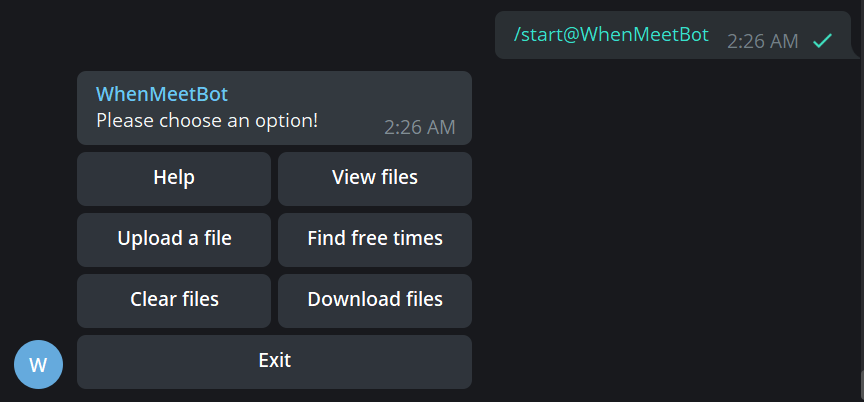
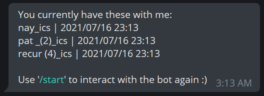
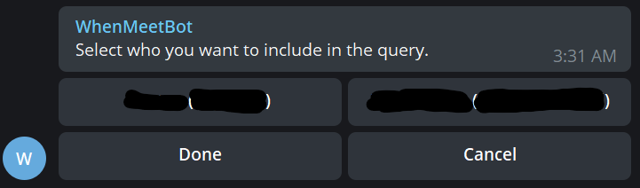
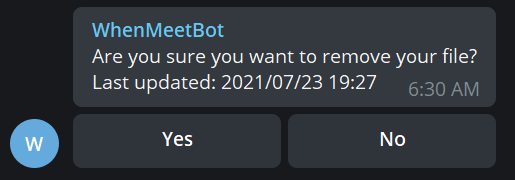

# README

Created: June 16 2021, 1:49 AM

## Team Name:

Team Tomodachi

---

## Proposed Level of Achievement:

Apollo 11

---

## Motivation:

Ever feel like you have too many friends and too little time to hang out? Or maybe you have some friends, but have sub-par time management so you can’t find common time to hang out?

Or maybe, you’re tired of asking your friends on Telegram “eh bro when you free” for the 42069th time and having different people give you different answers?

So are we (except for the first point). We realized that it was an arduous task to coordinate group hangouts, project meetings or even consults in NUS, given that most people take different modules and have different commitments. This got us thinking, how could we help people (especially ourselves) coordinate schedules better?

Most NUS students utilize NUSMods, while most working professionals utilize an e-calendar of some sort. This got us thinking: why are we not making use of this, but are instead still fumbling around trying to manually find a timing that works for everyone?

Aim:
We hope to bypass the cumbersome process of planning and coordinating for groups of people by automating the process of finding common time slots where everyone is free.

---

## User Stories:

1. As a user with a group of friends who have differing schedules, I want to be able to find common time slots to hang out without having to manually check day by day, person by person.
2. As a teaching assistant, a student or even a professor who wishes to set up consultations, I want to be able to schedule them with less hassle.
3. As a student involved in multiple projects, I want to be able to schedule project meetings with teammates without having to hound them.

---

## Program Flow:

---

## Development Flow:

### Milestone One (31/05/2021):

1. Setup database for Python Telegram Bot
2. Implement stand-alone algorithm for parsing .ics files and finding free times given multiple .ics files
3. Implement skeleton for Python Telegram Bot

### Milestone Two (28/06/2021):

1. Implemented core features of the Telegram bot for group use
    - Start and help menu for new users of the bot
    - Uploading of a single .ics file per user to the bot
    - Deleting the file uploaded by the specific user
    - Querying for list of free time based on
        - Selected users
        - Start Date and Time
        - End Date and Time
        - Minimum Interval (from 0 to 24 hours, in per hour blocks)
    - Exiting at any part of the upload/query process
2. Implemented core features of the Telegram bot for private use 
    - Start and help menu for new users of the bot
    - Uploading of .ics (and only .ics) files to the bot
    - Allow users to view all files uploaded by them
    - Allow users to specify which files to use (in PM mode)
    - Deleting all user-uploaded files
    - Option for users to specify which fileto delete (when using bot in PM mode)
    - Querying for list of free time based on user provided start date, end date and interval
        - Start Date and Time
        - End Date and Time
        - Minimum Interval (from 0 to 24 hours, in per hour blocks)
    - Exiting at any part of the upload/query process
3. Redesign data model to store file metadata (date, name) as shown below:

    group

        groupid

            users

                userid

                    'icalrep' : icalstr

                    'dateupdated' : date

    private

        userid

            files

                filename

                    'icalrep' : icalstr

                    'datecreated' :  date

4. Deployed Telegram bot on Heroku under "when-meet-bot".

### Milestone Three (26 July):

1. Refine the algorithm
    - Make result formatting more intuitive for users to read
        - Informs users of spill-over timings as well as the date that a block of free time spills over to
        - Included day, as well as adjusted date formatting to DD-MM-YYYY
        - Reimplemented the formatter in order to be able to process spill-overs more accurately in both parsing and calculation
    - Improve correctness of algorithm
        - Allow algorithm to take input timings into account as well during calculations
        - Perform unit testing on algorithm
2. Implement/refine extra features for Telegram bot
    - Option for users to generate a poll based off the results of their search query
    - Allow group administrators to delete .ics files uploaded by members
    - Allow users to merge multiple calendars in PM
    - Made help menu more intuitive to navigate and provide more explanation pertaining to the workings of the bot.
    - Allow users to upload multiple files to the bot in PM without having to repeatedly call '/start'
    - Display all previous included users when using the 'Find free times' function
    - Ask for confirmation before performing deletions when using the 'Clear files' function
3. Refined user interface to be more user friendly
    - Through the usage of Inline Keyboards instead of Reply Keyboards
    - Through a redesign of program flow to allow all features to be accessed from a single command
    - Reimplemented program flow such that commands would not interrupt each other
4. Allow users to download previously uploaded files
5. Perform unit testing for validation of algorithm
6. Perform user testing for bot and validation
7. Perform exploratory testing for bot features

---

## Tech Stack:

### Developing the Algorithm and the Bot:

- Python

We wanted to create a Telegram bot as it would be readily accessible to users from any platform, since Telegram is one of the most popular platforms for communication and it is available on a browser, a phone, a tablet, a computer, and more without exclusivity. 

Python and its libraries are popular and well-documented for us to be able to come up with appropriate solutions for handling, parsing and processing user-inputted .ics files, then parsing the output of the algorithm to a proper, user-friendly text message, as well as a poll in Telegram chats through a Telegram bot. 

### Back-End:

- Database: Firebase Realtime Database
- Hosting: Heroku

We needed a simple and effective backend infrastructure that is friendly to new developers, so we chose Firebase Realtime Database to store the .ics files uploaded by the users. We also used a hosting service Heroku to host our python Telegram bot, since the process is also very well-documented as well. 

We initially considered using Firebase Hosting to host our Telegram bot, but found that it did not support Python scripts which would necessitate the use of other frameworks such as Flask to host. We also considered other Cloud options such as Google Cloud, however it required payment. As we did not wish to complicate the hosting process, we decided to utilize Heroku instead.

### Other library dependencies:

- `icalendar`==4.0.0

    `icalendar` is a package which is RFC 5545 compatible parser and generator for iCalendar files. This is necessary for us to be able to parse through the user-inputted iCalendar files. 

- `Pyrebase4`==4.4.3

    `Pyrebase4` is a Python library package which provides an API that allows us to interact with the Firebase database from our Python code. This is necessary for us to be able to perform the relevant CRUD operations on .ics files and other relevant data for the bot's functions. 

- `python-telegram-bot`==13.5

    `python-telegram-bot` is a pure Python interface for the Telegram Bot API. This is a wrapper to code a Telegram bot in Python, and allows us to be able to retrieve and send messages, data, etcetera, while also helping us to manage the control flow of the Telegram bot. 

- `pytz`==2021.1

    `pytz` package brings the Olson tz (timezone) database into Python. This library is necessary for us to be able to perform adjustments to timezones for events in different calendars from different users, generated from different platforms, and allows them to be processed commonly in the same algorithm. 

- `recurring-ical-events`==0.2.0b0

    Each .ics files include several events, and after parsing the .ics files into string, we use the `recurring-ical-events` package to be able to process the parsed .ics files in order to view individual events as OOP objects, thereby allowing our algorithm to filter them using a given interval and process it in our algorithm. In addition, `recurring-ical-events` deals with the problem of recurring events that are not easily processed using standard Python string methods.

    ---

    ## Description and Features:

    [findtimes.py](http://findtimes.py) (previously [proofOfConcept.py](http://proofOfConcept.py)) is a Python script that describes an algorithm which now accepts as input a list of text files as well as a start date, end date and a minimum duration (0 to 24 hours). It then finds blocks of free time common amongst all .ics files that are at least of the given minimum duration, between the provided start and end dates.

    The Telegram bot (stored in main_whenmeetbot.py) has been prepared with a connection to the Firebase Realtime Database that will be used to store the provided .ics files based on relevant Group or User ID.

    ### Telegram Commands:

    - In order to interact with the bot, use `/start` to begin:

      

    - "Help" → Pops out a menu of buttons to check what the user requires help with.

      

      - "How does the bot work?" → Briefly explains how the bot works in a Group Chat and in a Private Message environment, and prompts the user to check on which environment would he require more help for.

        

        - "Use in a Group Chat" → Explains to the user in detail on how to use the bot in Group Chat.

          

        - "Use in Private Message" → Explains to the user in detail on how to use the bot in Private Message.

          

        - "Cancel" → Exits the bot completely.

          

        - "Go Back" → Goes back to the previous help menu.

          

      - "How do I export an .ics file from my calendar app?" → Opens up a list of hyperlinks to guide users on how to export their calendars from commonly used calendar apps.

        

      - "How do I use the commands?" → Briefly explains how all the commands work, and allows users to click on buttons for further elaboration on more complex commands.

        

        - "How to I use 'Upload a file'?" → Explains to the user how to use 'Upload a file' command

          

        - "How do I use 'Find free times'?" → Explains to the user how to use 'Find free times' command

          

        - "How do I use 'Clear files'?" → Explains to the user how to use 'Clear files' command

          

        - "How do I use 'Download files'?" → Explains to the user how to use 'Download files' command

          

        - "Go Back" → Goes back to the previous help menu.

          

        - "Cancel" → Exits the bot completely.

          

      - "Cancel" → Exits the bot completely.

        

    - "View files" → Shows all the files that is stored in there server for that chat, along with some metadata.

      For example,

      - Group:

        Each file is formatted as:

        <Full Name> (<Username>) | Updated: <Date updated in YYYY/MM/DD HH/MM format>

        

      - Private:

        Each file is formatted as:

        <File Name> | Updated: <Date uploaded in YYYY/MM/DD HH/MM format>

        

      - If no files:

        

    - "Upload a file" → Allows the user to upload a .ics file. (Rejects any other file type)

      - Group:

        - If you have uploaded a file previously:

          

          - "Yes" → Replace the existing file with the new file the user uploads.

            

          - "No" → Exits the bot

            

        - Otherwise:

          The bot runs as per normal

          

      - Private:

        Regardless of whether you have previously uploaded files, user can keep uploading files until you exit with "/cancel"

        

    - "Find free times" → Allows the user to perform the main query function to find common free times

      1. User will be asked to select who/ what files to include in the query.

         1. Group Chat

            User is to select which of the group members (and their files) to be included in the query

            e.g.

            

            after selecting a member:

            

         2. Private Message

            User is to select which of the uploaded files to be included in the query

            e.g.

            

            after selecting two files:

            

      2. After selecting files, enter in a start date and time of the interval in DD/MM/YYYY HH:MM format:

         

      3. After entering start date and time of the interval, enter the end date and time of the interval in the same format:

         

      4. After entering the end date and time of the interval, enter the length of the interval (in hours) from 1 to 24

         

      5. Results:

         1. Group Chat

            User will be allowed to generate a poll IF there are more than one slot of valid free time interval available.

            e.g.

            

            - "Yes" → Poll generated

              

            - "No" → Poll not generated

              

         2. Private Message

            User will just be given the list of valid time intervals

            

    - "Clear files"

      - Group Chat

        Group Member:

        - If you have a file uploaded:

          

        - If you do not have a file uploaded

          

        Administrator:

        - Administrator will be allowed to choose to delete from all of the files uploaded by all the members:

          e.g.

          

          - After deleting a member's file, if there are still files left:

            

          - If there are no more files left:

            

          - "Clear All" → Deletes all files uploaded by all members in the group

            

          - "Cancel" → Exits the bot completely.

            

      - Private Message

        User will be asked to choose files he wishes to delete.

        e.g.

        

        After deleting test1_ics,

        

        - "Clear All" → Deletes all files uploaded by the user

          

        - "Done" → Exits the bot completely

          

    - "Download files"

      - Group Chat

        Allows the user to retrieve his own file stored in the database

        

        - "Yes" → Download the file

          

        - "No" → Exit the bot

          

      - Private Message

        Allows the user to choose each individual ics file stored in the database, download all of them, or merge them all into a single file

        

        - "Download All" → Allows user to download all files individually at once

          

        - "Merge All" → Allows the user to merge all the uploaded ics files into a single file and download it

          

        - "Cancel" → Exit the bot completely

          

        - "<Filename>_ics" → Download that particular file

          Clicking on nay_ics:

          

    - "Exit" → Closes the current instance of the user and the bot. A new instance cannot be started if the user does not exist the current instance.

      

    ---

    ## Software Development Practices:

    ### GitHub:

    Apart from actively communicating through Discord and Telegram, in order to discuss development plans and conducting meetings, we also used GitHub to ease of collaboration for the project. While GitHub offers version control system that allows users to branch out and develop features without compromising the integrity of the main branch, we made the decision to use GitHub more as a development log and a backup system, and decide to perform majority of the commits from a selected member. 

    This is because for a team of 2 members, we found that it was more efficient to work on the project through our online meetings, and performing commits mainly from a single member at the end of each meeting helped to structure a very efficient workflow, and helps us to brainstorm and work on more things throughout the meeting. 

    We primarily used GitHub as a development log, as we are able to refer to the commit messages in order to see what changes are made through each commit and actively synchronise it with our project logs.

    We also used GitHub as a backup system, where if we made mistakes in adjustments, we retrieve and develop on our older version to make relevant adjustments. 

    ### Notion:

    Notion is an online wiki platform that uses markdown, and is the platform that we use actively as another platform to keep track of the features, bugfixes, and other development plans we have in mind for our bot. Our To-Do lists, bug tracking, user test interviews, README, and more were almost entirely developed and organised through Notion as well, using a shared workspace (akin to Google Docs, except with better formatting for code and more). 

    ### Code Style:

    In order to make code more readable, as well as to made code more understandable at a glance, we made sure to actively write comments explaining what each block of code does. This allows us to bugfix and develop our algorithm and the Telegram bot much more efficiently and effectively. 

    We also based our code on the Standard Python Style Guide PEP 8 (as linked below) in order to make code more readable and standardised as well. 

    [PEP 8 -- Style Guide for Python Code](https://www.python.org/dev/peps/pep-0008/)

    ---

    ## Software Development Principles:

    ### Abstraction and Single Responsibility Principle (SRP):

    For the algorithm, we are able to abstract out different parts of the processing into different functions in order to ensure that each step of the processing is handled by a single function. For instance, merging all the .ics files is handled by `merge_ics`, parsing is handled by `new_parse_output_ics`, interval calculation/ result generation is handled by `find_free_times`, and lastly, parsing of the results into a ready-to-use dictionary of strings is done by `result_formatter`.

    For the Telegram bot, however, we are restricted by the API, and are not able to fully apply this principle. The fact that we have to control the flow of the bot based on the usage through handlers makes it such that we are only able to isolate each function to be singular states, but not of singular responsibility as the principle states. 

    Moreover, most of our code does not involve OOP, and therefore could not apply the OOP principles, since it was abstracted away by the libraries we imported (e.g. `recurring-ical-events`).

    ---

    ## Testing

    ### User Testing

    [https://docs.google.com/document/d/1U699b1wjOvqix6aDpow5_WXMiaticmorFSKE0Tc-2JQ/edit?usp=sharing](https://docs.google.com/document/d/1U699b1wjOvqix6aDpow5_WXMiaticmorFSKE0Tc-2JQ/edit?usp=sharing)

    ### Unit Testing

    [https://docs.google.com/document/d/14Uiq3gb3Qm5fMW5vp8Es9Xr855BdnDYmGD5lqjB_XE8/edit?usp=sharing](https://docs.google.com/document/d/14Uiq3gb3Qm5fMW5vp8Es9Xr855BdnDYmGD5lqjB_XE8/edit?usp=sharing)

    ### Exploratory Testing

    [https://docs.google.com/spreadsheets/d/1LHkoJpRCVTs2nxveF05rDRwjDkDSkfAezMqHjjC0wBk/edit?usp=sharing](https://docs.google.com/spreadsheets/d/1LHkoJpRCVTs2nxveF05rDRwjDkDSkfAezMqHjjC0wBk/edit?usp=sharing)
